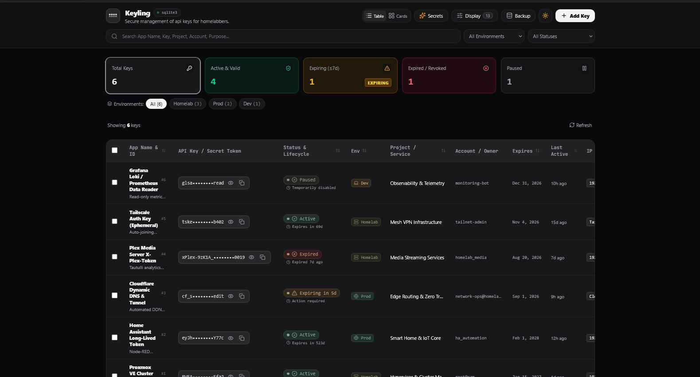
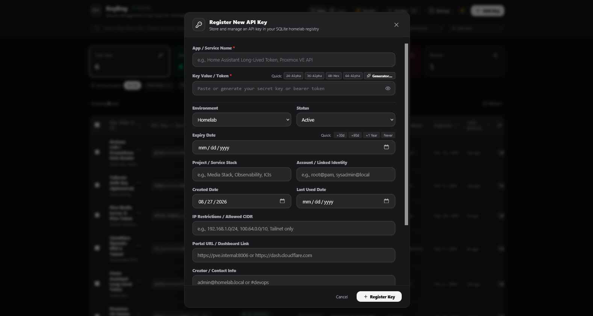
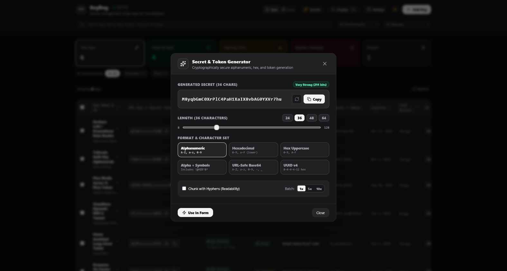
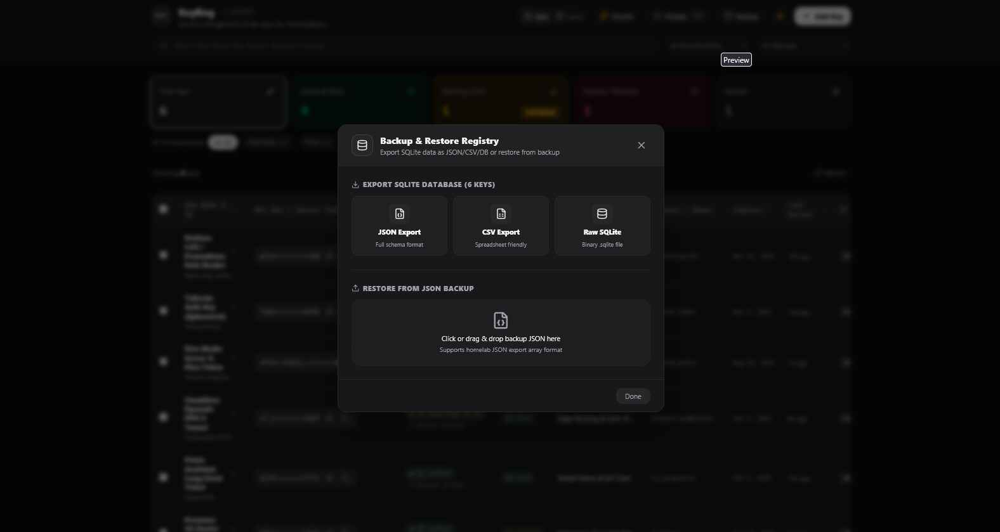

# Homelab API Key and Secret Manager

A lightweight, self-hosted web registry designed for homelab administrators, developers, and self-hosters to securely organize, track, and generate API keys, bearer tokens, service account credentials, webhooks, organization IDs, and client IDs.

---

## Screenshots

### Main Dashboard
The primary overview featuring configurable table and card views, lifecycle status badges, search, environment filtering, and bulk operations.



### Register and Edit API Key
Modal form allowing detailed credential registration with optional fields including Organization ID, Client ID, CIDR restrictions, owner contact, and expiration timelines.



### Cryptographic Secret Generator
Built-in password and secret generator supporting customized character sets, hex formats, UUIDs, custom prefixes, entropy calculation, and password strength evaluation.



### Automated Backups and Database Maintenance
Database management center for downloading full SQLite database snapshots, triggering manual snapshots, restoring from files, and managing rotation limits.



---

## Purpose and Use Cases

In homelab and self-hosted environments, administrators regularly manage dozens of tokens across local and cloud services such as Home Assistant, Proxmox VE, TrueNAS, Pi-hole, Plex, Cloudflare, OpenAI, Tailscale, GitHub, and custom microservices.

Traditional password managers can be heavyweight or poorly optimized for API token metadata (such as allowed CIDR ranges, environment scoping, last-active tracking, or copyable code snippets). Homelab API Key Manager provides a dedicated, lightweight control plane designed specifically for API tokens and developer credentials.

---

## Key Features

- Local SQLite Database: All data is stored in a single SQLite database file using sql.js, requiring zero external database setup.
- Custom Field Visibility: Customize visible attributes through configurable presets (Minimal, Standard, Developer, Full) or custom field toggles.
- Organization ID and Client ID Support: Dedicated fields for provider Account Organization IDs and App Client IDs with individual masking and one-click copy buttons.
- Cryptographic Secret Generator: Generate high-entropy secrets, alphanumeric tokens, hex keys, and UUIDs with adjustable lengths, custom prefixes, and strength meters.
- Security Masking and Clipboard Copy: Sensitive values are masked by default with reveal eye toggles and instant clipboard copy feedback.
- Lifecycle and Expiration Tracking: Track active, paused, and revoked tokens with automated expiration indicators (Expired, Expiring Soon, Active).
- Last Used Tracking: Touch tokens to log when they were last used in automation scripts or manual workflows.
- Integration Code Snippets: Instant generation of ready-to-use snippets in Bearer header, X-API-Key header, cURL, Python requests, and .env formats.
- Live Search and Multi-Criteria Filtering: Filter by keyword, environment (Homelab, Prod, Dev, Staging, DMZ), status, or project name with sorting on any column.
- Bulk Operations: Multi-select items to batch-delete, batch-update status, or batch-export selected keys.
- Backup and Restore: Automated SQLite database snapshots on mutation, manual snapshot triggers, JSON export/import, and CSV spreadsheet exports.
- Dual Themes: Native dark and light mode with high-contrast borders and ergonomic typography.

---

## Important Security Warnings

Please read these warnings carefully before deploying:

1. No Built-In Authentication: This application contains NO authentication, user accounts, or login system. Anyone with network access to the application port can view, edit, and delete stored keys.
2. Do Not Expose Publicly: NEVER expose this application directly to the public internet without an authentication layer in front of it.
3. Recommended Network Architecture:
   - Run exclusively inside an isolated local network (LAN) or a private overlay network (such as Tailscale, WireGuard, or Netmaker).
   - If remote access is required, place the application behind an authenticating reverse proxy such as Authelia, Authentik, Cloudflare Zero Trust / Access, Nginx Proxy Manager with HTTP Basic Auth, or Traefik Forward Auth.
4. Database Storage: Keys and secrets are stored in standard SQLite table columns on disk. If full disk encryption or hardware security module (HSM) level storage is required, configure volume encryption on your host operating system.

---

## Installation and Deployment

Default service port: `6644`

### Method 1: Local Node.js Installation with PM2 (Recommended for Bare Metal & VMs)

PM2 is a production process manager for Node.js that keeps your application running continuously in the background, automatically restarts it on crashes, and boots it on system startup.

#### Prerequisites
- Node.js 18.x or higher
- npm 9.x or higher

#### Step 1: Install Dependencies and Build

1. Clone or extract the repository:
   ```bash
   git clone <repository-url>
   cd <repository-directory>
   ```

2. Install dependencies:
   ```bash
   npm install
   ```

3. Build the frontend and backend bundle:
   ```bash
   npm run build
   ```

#### Step 2: Running with PM2

1. Install PM2 globally if not already installed:
   ```bash
   sudo npm install -g pm2
   ```

2. Start the application using the bundled `ecosystem.config.cjs`:
   ```bash
   pm2 start ecosystem.config.cjs
   ```

   *Alternatively, start directly using CLI arguments:*
   ```bash
   PORT=6644 pm2 start dist/server.cjs --name "keyling"
   ```

3. Save the process list and enable automatic boot startup:
   ```bash
   pm2 save
   pm2 startup
   ```
   *(Run the generated `sudo env PATH=...` command displayed by PM2 to complete setup).*

4. The application is now running at `http://localhost:6644`.

#### PM2 Management Commands

- View service status:
  ```bash
  pm2 status
  ```
- View real-time logs:
  ```bash
  pm2 logs keyling
  ```
- Restart the service:
  ```bash
  pm2 restart keyling
  ```
- Stop the service:
  ```bash
  pm2 stop keyling
  ```
- Delete the service from PM2:
  ```bash
  pm2 delete keyling
  ```

---

### Method 2: Standard Node.js Run (Foreground)

If you prefer running directly without a process manager:

1. Build the application:
   ```bash
   npm run build
   ```

2. Start on default port `6644`:
   ```bash
   PORT=6644 npm start
   ```

3. For local development with live reloading:
   ```bash
   npm run dev
   ```

---

### Method 3: Docker Installation

#### Running with Docker CLI

1. Build the Docker container image:
   ```bash
   docker build -t homelab-key-manager .
   ```

2. Run the container with default port `6644:6644` and persistent volume storage:
   ```bash
   docker run -d \
     --name homelab-key-manager \
     --restart unless-stopped \
     -p 6644:6644 \
     -v $(pwd)/data:/app/data \
     homelab-key-manager
   ```

   The application will be accessible at `http://localhost:6644`.

---

### Method 4: Docker Compose (Recommended for Container Homelabs)

A pre-configured `docker-compose.yml` is included in the root directory.

1. Verify `docker-compose.yml`:
   ```yaml
   services:
     key-manager:
       build:
         context: .
         dockerfile: Dockerfile
       container_name: homelab-key-manager
       restart: unless-stopped
       ports:
         - "6644:6644"
       environment:
         - NODE_ENV=production
         - PORT=6644
       volumes:
         - ./data:/app/data
   ```

2. Start the service:
   ```bash
   docker compose up -d
   ```

3. View container logs:
   ```bash
   docker compose logs -f
   ```

4. Stop the service:
   ```bash
   docker compose down
   ```

---

## Configuring and Changing the Port

The application defaults to port `6644`. You can change this port to any available port number on your host system:

### 1. Changing Port with PM2 or Node.js

Set the `PORT` environment variable when starting:

- **Via PM2 CLI:**
  ```bash
  PORT=8080 pm2 start dist/server.cjs --name "keyling" --update-env
  ```
- **Via `ecosystem.config.cjs`:**
  Edit the `PORT` value inside `ecosystem.config.cjs`:
  ```javascript
  env: {
    NODE_ENV: "production",
    PORT: 8080, // Set desired port here
  }
  ```
  Then reload PM2:
  ```bash
  pm2 restart ecosystem.config.cjs --update-env
  ```
- **Via Direct CLI Execution:**
  ```bash
  PORT=8080 npm start
  ```

### 2. Changing Port with Docker CLI

Map your preferred host port to the container port (e.g., binding host port `8080` to container port `6644`):

```bash
docker run -d \
  --name homelab-key-manager \
  --restart unless-stopped \
  -p 8080:6644 \
  -v $(pwd)/data:/app/data \
  homelab-key-manager
```

The application will now be reachable on `http://localhost:8080`.

### 3. Changing Port with Docker Compose

In `docker-compose.yml`, change the host port in the `ports` mapping:

```yaml
    ports:
      - "8080:6644" # Format: "<HOST_PORT>:<CONTAINER_PORT>"
```

Then recreate the container:
```bash
docker compose up -d
```

---

## Data Storage and Persistence

- Database Engine: SQLite compiled to WebAssembly via `sql.js`, running inside the Node.js backend.
- Storage Directory: Stored in the `./data` directory relative to the application root (or `/app/data` inside Docker).
- Primary Database File: `data/homelab_keys.sqlite`
- Automatic Schema Migrations: The database automatically verifies and applies schema updates (including additions like `org_id` and `client_id`) on startup without erasing existing entries.
- Automated Backups: Timestamped database copies are stored in `data/backups/`. The backup manager keeps the 10 most recent snapshots and rotates older files automatically.
- Export Formats:
  - Full SQLite database file (`.sqlite`)
  - Structured JSON export (`.json`)
  - Tabular CSV spreadsheet (`.csv`)

---

## Transparent Disclosure (Vibe Coded)

This project is proudly "vibe coded" with the assistance of AI coding agents, designed to solve a practical homelab utility need quickly, cleanly, and reliably. The code prioritizes readability, modular TypeScript components, clean visual spacing, standard REST endpoints, and zero extraneous dependencies.

---

## License

This software is released under the MIT License. You are free to use, modify, distribute, fork, and adapt this software for personal, educational, or commercial purposes without restriction.

```
MIT License

Copyright (c) 2026

Permission is hereby granted, free of charge, to any person obtaining a copy
of this software and associated documentation files (the "Software"), to deal
in the Software without restriction, including without limitation the rights
to use, copy, modify, merge, publish, distribute, sublicense, and/or sell
copies of the Software, and to permit persons to whom the Software is
furnished to do so, subject to the following conditions:

The above copyright notice and this permission notice shall be included in all
copies or substantial portions of the Software.

THE SOFTWARE IS PROVIDED "AS IS", WITHOUT WARRANTY OF ANY KIND, EXPRESS OR
IMPLIED, INCLUDING BUT NOT LIMITED TO THE WARRANTIES OF MERCHANTABILITY,
FITNESS FOR A PARTICULAR PURPOSE AND NONINFRINGEMENT. IN NO EVENT SHALL THE
AUTHORS OR COPYRIGHT HOLDERS BE LIABLE FOR ANY CLAIM, DAMAGES OR OTHER
LIABILITY, WHETHER IN AN ACTION OF CONTRACT, TORT OR OTHERWISE, ARISING FROM,
OUT OF OR IN CONNECTION WITH THE SOFTWARE OR THE USE OR OTHER DEALINGS IN THE
SOFTWARE.
```
